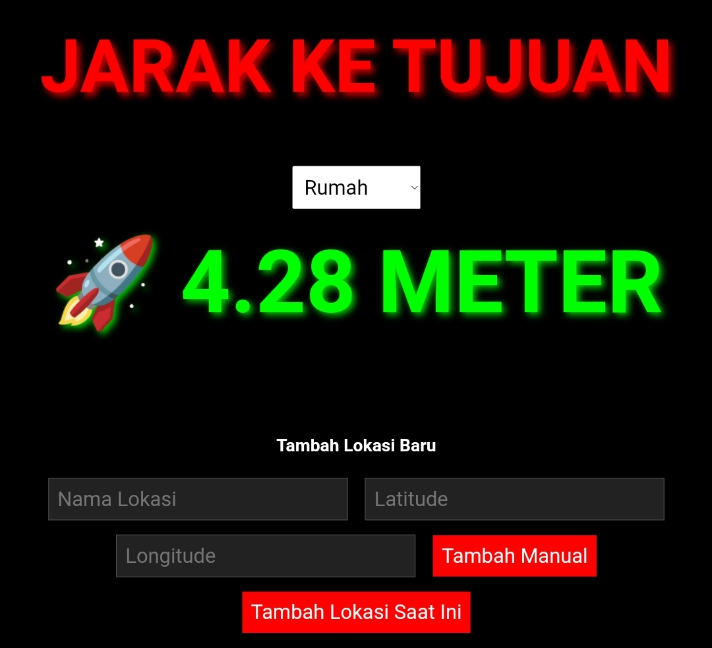

## Tampilan

## Apa Fungsinya?
* Anda bisa mengetahui jarak secara realtime bahkan saat offline
* Anda bisa menambahkan database lokasi yang akan menjadi target
* Menggunakan rumus jarak Harvesine dengan longtitude dan latitude yang menghasilkan output jarak dari lokasi saat ini sampai lokasi target

## Kelemahan
* Saat offline, lokasi bisa tidak ada output / kurang akurat 1-10 meter tapi solusinya menghidupkan data
* Saat offline lebih baik di lokasi terbuka karena satelit lebih akurat di outdoor daripada didalam rumah

Ini Projek Gabut saya
